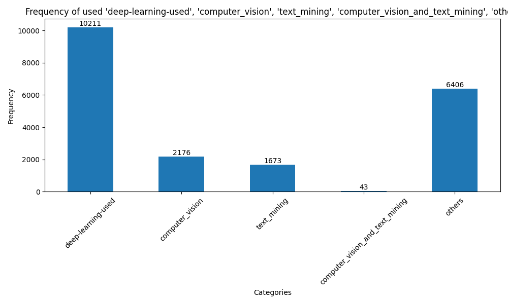

# Environment:
- install anaconda
- install GIT
- create a conda environment with python version >= 3.8
- Then install all the libararies mentioned in the Requirement

# Requiments

- ! pip install spacy
- ! pip install transformers
- ! pip install pandas
- ! pip install numpy
- ! pip install matplotlib
- Install pytorch version , with cuda 11.8 (pip3 install torch torchvision torchaudio --index-url https://download.pytorch.org/whl/cu118)
- python -m spacy download en_core_web_sm

- Please also see the requirement.txt

# Instruction to run the code

- clone the repo : git clone https://github.com/abhishekdiphu/filter_pipeline.git

- go to the folder in the terminal by: cd filter_pipeline

- create a anaconda environment : conda create -n scinext python=3.9

- activate the anaconda environment: conda activate scinext

- install all the necessary librabies: pip install -r requirements.txt

- to run the whole pipeline (Task1 + Task2 + Task3 ) , please execute the script main.py using:  "python main.py"

# Dataset:

### The dataset can be accessed at Virology AI Papers Repository. It includes a header row and multiple data rows generated from keyword-based searches. The list of keywords used for the searches is available here.

# Tasks: Screening Task, Semantic NLP Filtering for Deep Learning Papers in Virology/Epidemiology

## Task 1:Implement semantic natural language processing techniques to filter out papers that do not meet the criteria of utilizing deep learning approaches in virology/epidemiology.

- step 1: preprocessing the dataset, and removed rows that has NaN in the Abstract column
- step 2: prepared a new dataframe , which has only "PMID" , "Title" , "Abstract" column where NAN rows are droped from 
- step 3: used keyword based filtering method (rule based)

- step 4: using a LLM , used zeroshot classification to either deep learning, machine leanring or non deep learning

## Task 2: For the papers deemed relevant, classify them according to the type of method used: ["text mining", "computer vision", "both", "other"].

- step 1: using a LLM , used zeroshot classification to "text mining", "computer vision", "image processsing", "text mining_and_computer vision", "others", "natural language processing"

- "computer vision", "image processsing"  is categorized as "computer vision".

- "text mining", "natural language processing"  is categorized as "text mining".

- if both computer vision and text mining exist, then , it is set to "computer_vision_and_text_mining"

- if non of them exist set it to "others"

## Task 3: Extract and report the name of the method used for each relevant paper.

- step 1: using a LLM , used zeroshot classification to "method", "result" ,"conclusion", "context"

- sequences of sentences classified as method in each abstract are joined and saved in a seperate column "method_used"

# Results 
- 
-
-

# Discusion:
## which NLP technique for filtering the papers have you used? 
- 
- 
- 
-

## Why do you think your approach will be more effective than keywords-based filtering? 
-
- 
- 
-

## What are the resulting dataset statistics?
-
-
-
-

# Summary

